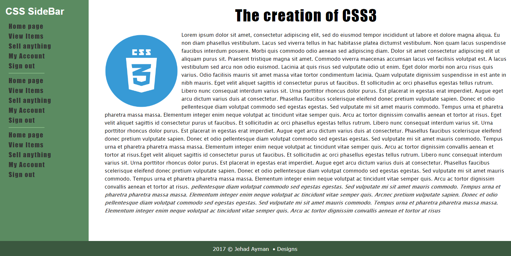

# Simple-CSS-Sidebar
Simple HTML &amp; CSS Sidebar using the float property and some other styles to make it look beautifull .
All you have to do is clone the project or download the files then try reading and understanding the code.
all styles are pure css with no single line of frameworks.

